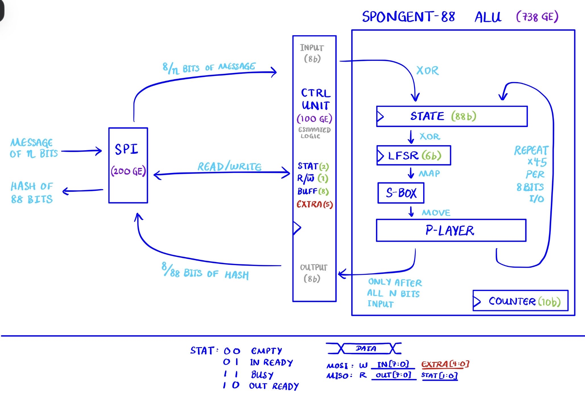

# Proposal

## Statement of purpose
We are implementing the SPONGENT-88 hash function [1]. From the original paper: “As crucial applications go pervasive, the need for security in RFID and sensor networks is dramatically increasing, which requires secure yet efficiently implementable cryptographic primitives including secret-key ciphers and hash functions” [1].

According to [1], as of 2011, SPONGENT had the smallest hardware footprint relative to comparably secure hash functions. This is why we chose it.

We will implement this as a SPI peripheral (slave) device.

## System diagram

## IO pin assignment table (Tiny Tapeout pins)

| Tiny Tapeout Pin | Assignment |
|:---:|:---:|
| ui[0] | SCLK |
| ui[1] | CS |
| ui[2] | MOSI |
| uo[0] | MISO |

All other pins unused.

## Proposed specification
| Parameter | Value |
|:---:|:---:|
| Max SCLK frequency | TBD |

Refer to [1] for SPONGENT-88 algorithm specifications.

## Timeline for completion | Who does what
| Date | Milestone | Done by |
|:---:|:---:|:---:|
| 10/09/2026 | SPI module | Robin |
| 10/09/2026 | SPONGENT core stub | Ronson |
| 10/16/2026 | LFSR | Robin |
| 10/16/2026 | sBox | Ronson |
| 10/23/2026 | pLayer | Robin |
| 10/23/2026 | Start control | Ronson |
| 11/06/2026 | Finish control | Both |
| 11/20/2026 | Test and debug | Both |

Tentative completion date: 11/27/2026

## References
[1] A. Bogdanov, M. Knezevic, G. Leander, D. Toz, K. Varici, I. Verbauwhede, "SPONGENT: A Lightweight Hash Function," in CHES 2011, 2011, pp. 312-325, doi: https://doi.org/10.1007/978-3-642-23951-9_21.
